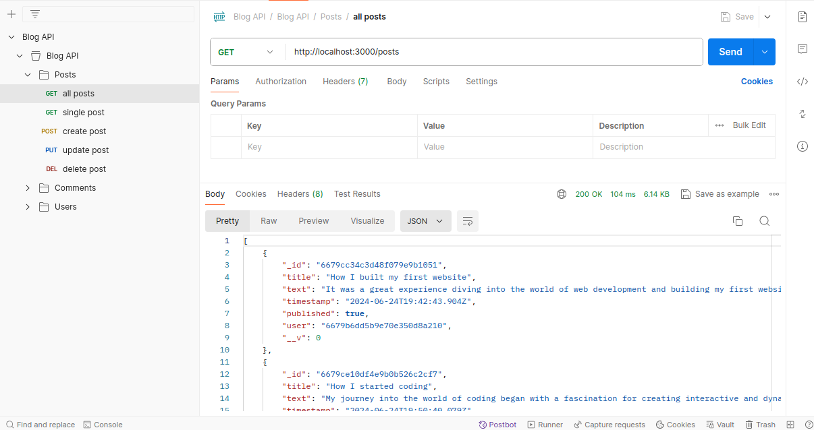
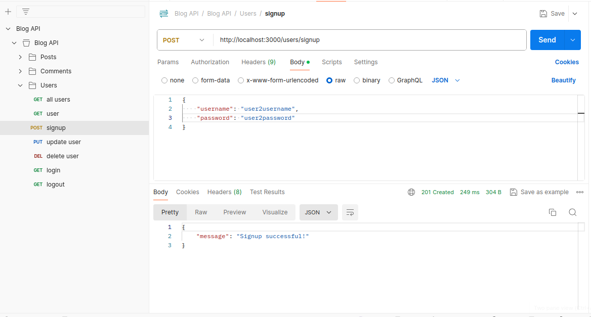
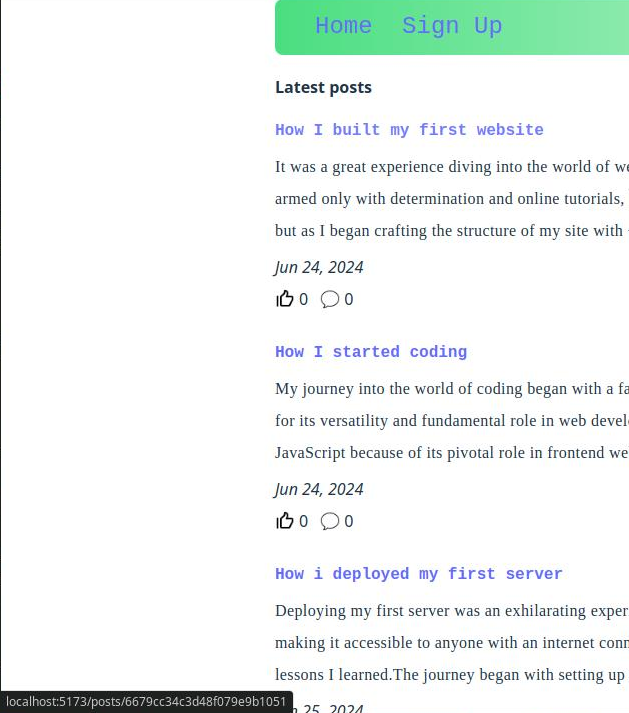
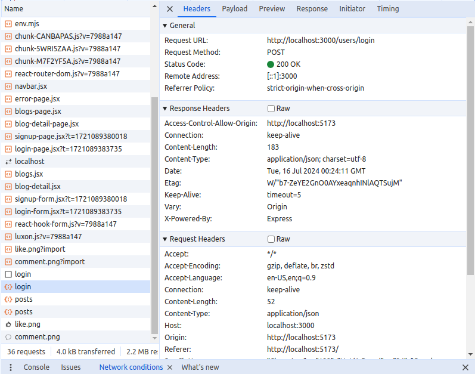
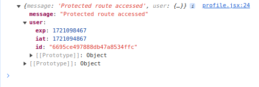

# BlogAPI

With this project I have practiced and applied:

- <b>RESTfulAPI</b> endpoints with Postman,

  - keep related api endpoints together for easier navigation and management
  - facilitate clear API documentation by grouping endpoints logically within folders

    

  - test endpoints with a <b>mocked object </b> to make sure they are working right

    

  - use HTTP requests to access and use data
  - here we fetch and display all posts from the database
  - each post has an unique <b>id</b> and can be accessed and displayed in detail upon click

    

- understand reading the <b>Network</b> tab in Dev Tools
- understand the <b>CORS</b> mechanism from host and client

  

- Route protection with <b>JWT</b>

  - use of <b>Passport's JWT strategy</b> to verify JWTs
  - deny or allow access to the rest of the protected route
  - when user logs out, the client will remove the JWT from storage

  
